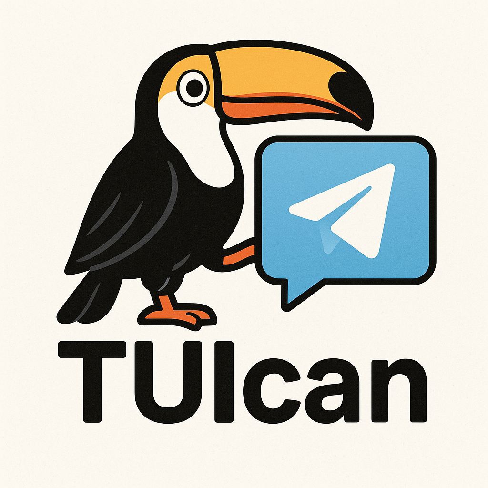

# TUIcan - Toolkit for User Intuitive Chat Application Navigation

**Under development, possible breaking changes!**



A Python library for building interactive Telegram bot interfaces with reusable UI components.


## Features

- 🏗️ Modular UI components (Buttons, Checkboxes, Input fields)
- 🖥️ Screen management with navigation support
- ♻️ Stateful components with change callbacks
- 📱 Message and callback query handling built-in
- 🔄 Declarative layout (no manual `render()` calls)
- 🛡️ Middleware pipeline for cross-cutting concerns
- 💾 Pluggable persistence (in-memory or JSON file)
- 🌐 Webhook or polling mode

## Adding to project

```bash
pip install "tuican[ptb]"
# or for all backends
pip install "tuican[all]"
```

## Quick Start

1. Create a `.env` file with your bot token:
```bash
echo "token=YOUR_BOT_TOKEN" > .env
```

2. Create a simple button screen:
```python
import os

from dotenv import load_dotenv

from tuican import Application
from tuican.components import Button, Screen

class MyScreen(Screen):
    description = 'main screen'
    def __init__(self):
        self.button = Button("Click me", on_change=self.handle_click)
        super().__init__([self.button], message="click the button")

    def handle_click(self, component):
        self.message = "Hello world!"

    def get_layout(self):
        return [[self.button]]  # declarative: no manual render() needed

load_dotenv()
token = os.getenv("token")
app = Application(token, {'start': MyScreen}, transport="ptb")
app.run()
```

## Core Components

### Button
Basic interactive button with click handler:
```python
Button(text="Click me", on_change=callback_function)
```

### Label
Non-interactive text label (renders as a disabled button):
```python
Label(text="Status: active")
```

### HLine
Horizontal separator line:
```python
HLine()  # renders as a divider row
```

### CheckBox
Toggleable checkbox with group support:
```python
group = ExclusiveCheckBoxGroup()
CheckBox(text="Option 1", group=group)
```

> **Note:** Setting `checkbox.selected = True` is a silent low-level override that does **not** fire `on_change` and does **not** maintain `ExclusiveCheckBoxGroup` invariants. Use `check()` / `uncheck()` / `toggle()` for side-effectful state changes.

### Input
Validated input field with configurable prompt:
```python
Input[int](
    text="Age:",
    validation_function=positive_int,
    active_prompt="Enter: "   # shown when input is active
)
```

### Screen Management
- `Screen`: Base container for components (supports `add_components()` and `delete_components()` for dynamic layouts)
- `ScreenGroup`: Handles navigation between screens

## Declarative Layout

`Screen.get_layout()` can return components directly. The library automatically calls `render()` for you:

```python
def get_layout(self):
    return [
        [self.btn1, self.btn2],           # row 1
        [self.checkbox],                  # row 2
        [self.input_field],               # row 3
    ]
```

You can still mix pre-rendered `KeyboardButton` objects if needed.

## Middleware

Register middleware to handle cross-cutting concerns like auth or rate limiting:

```python
@app.middleware
async def auth_middleware(update):
    user_id = get_user_id(update)
    if user_id not in ALLOWED_USERS:
        await app.backend.send_notification(update, "Access denied")
        return False
    return True
```

Return `False` to stop processing the update.

## Persistence

User command state is persisted automatically. By default an in-memory store is used (lost on restart). Use `JsonFileStateStore` to survive restarts:

```python
from tuican.stores import JsonFileStateStore

app = Application(
    token,
    {'start': MyScreen},
    state_store=JsonFileStateStore("bot_state.json")
)
```

## Webhook Mode

Run the bot in webhook mode instead of polling (PTB transport only):

```python
app.run_webhook(
    webhook_url="https://your-domain.com/webhook",
    listen="0.0.0.0",
    port=8080
)
```

## Telethon Backend

Use the Telethon transport for user-bot or client-style interactions. Telethon requires `api_id` and `api_hash` from [my.telegram.org](https://my.telegram.org) and does **not** support webhook mode.

```python
app = Application(
    token,
    {'start': MyScreen},
    transport="telethon",
    api_id=12345,
    api_hash="your_api_hash",
)
app.run()
```

## Custom Backend

The Telegram API is abstracted behind the `MessageBackend` protocol. You can provide a custom backend for testing or integrating with a different Telegram library:

```python
from tuican.backend import MessageBackend
from tuican.update import TuicanUpdate
from tuican.keyboard_button import KeyboardButton
from collections.abc import Sequence

class MyBackend(MessageBackend):
    async def send_keyboard_message(
        self,
        update: TuicanUpdate,
        text: str,
        keyboard_markup: Sequence[Sequence[KeyboardButton]],
        parse_mode: str = "HTML",
    ) -> None:
        ...

    async def send_plain_message(self, update: TuicanUpdate, text: str) -> None:
        ...

    async def send_notification(
        self, update: TuicanUpdate, text: str, delete_after: float = 1.0
    ) -> None:
        ...

    async def delete_message(self, update: TuicanUpdate, message_id: int) -> None:
        ...

    async def set_bot_commands(self, commands: dict[str, str]) -> None:
        ...

app = Application(token, screens, backend=MyBackend())
```

## API Reference

### Application
Main entry point:
```python
# Signature:
# Application(token, screens: dict[str, StartScreenProtocol], *, transport="ptb", state_store=None, backend=None, api_id=None, api_hash=None)
app = Application(token, screens, transport="ptb", state_store=None, backend=None)
```

### Component
Base class with:
- `handle_callback()` - Process button clicks
- `render()` - Create Telegram button
- `call_on_change()` - Trigger callbacks

## Examples

See the `examples/` directory for:
- `hello_world.py` — Simple counter + name input. Shows basic buttons and text input on a single screen.
- `todo_list.py` — Full todo app with dynamic layout updates and multi-screen navigation (list ↔ add todo).

## Requirements

- Python 3.13+
- python-dotenv (core)
- python-telegram-bot (optional, for PTB transport)
- telethon (optional, for Telethon transport)

## License

MIT
